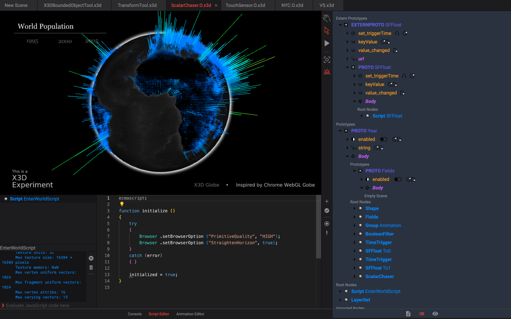

## Introduction

Sunrize is based on [X_ITE](https://create3000.github.io/x_ite/) and is a basic editor for X3D files. The scene can be edited in an Outline Editor and there is a Script Editor where Script nodes and ComposedShader nodes can be edited.

